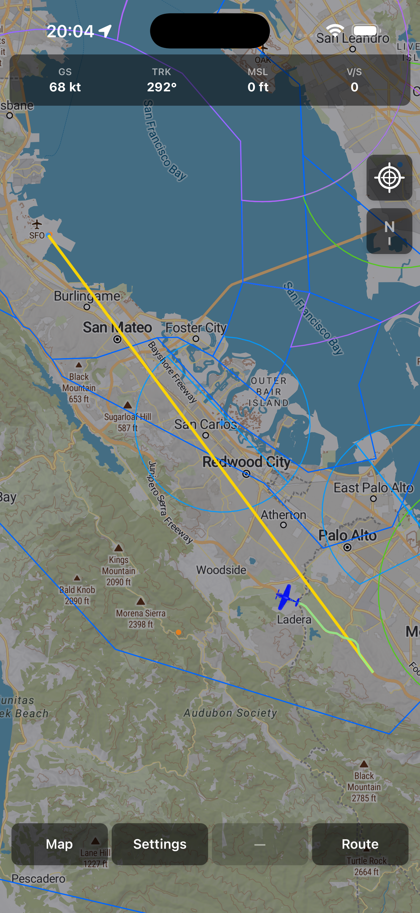
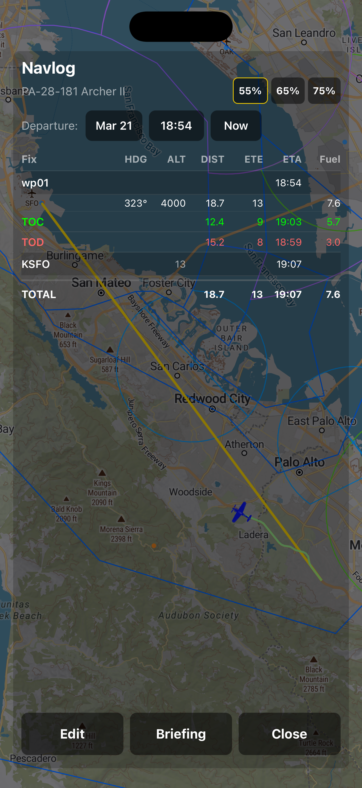
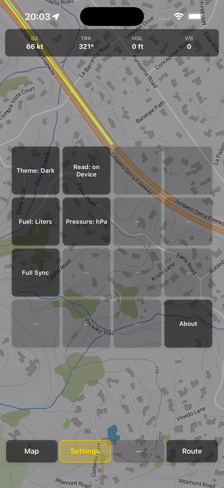

# VueloVista
## The Cockpit, Clarified.

VueloVista is a premier aviation mapping platform built for pilots who value speed, safety, and situational awareness. Designed to work as a seamless companion from pre-flight planning to active navigation, VueloVista ensures you have the data you need, exactly when you need it.

### Key Features

- **Intuitive Aviation Map:** Explore a responsive, interactive map featuring global airspaces, airports, and navigation aids designed for instant readability.
- **Cockpit-Ready Offline Mode:** Download and sync critical flight data before you take off, ensuring full map functionality and reliability even without an internet connection at altitude.
- **Live Flight Intelligence:** Stay informed with real-time displays of your GPS position, ground speed, altitude, and climb rate.
- **Heads-Up Navigation:** Use the "follow-me" mode to keep your aircraft centered and oriented, reducing workload during busy flight phases.
- **Flight Path Tracking:** Visualize your active flight track to maintain superior awareness of your progress and surroundings.
- **Professional Grade Reliability:** Built with a focus on stability and performance to ensure the map remains fluid and responsive during critical maneuvers.

### Screenshots

| | | |
|---|---|---|
|  |  |  |

---

Copyright © 2026 VueloVista. All rights reserved.
